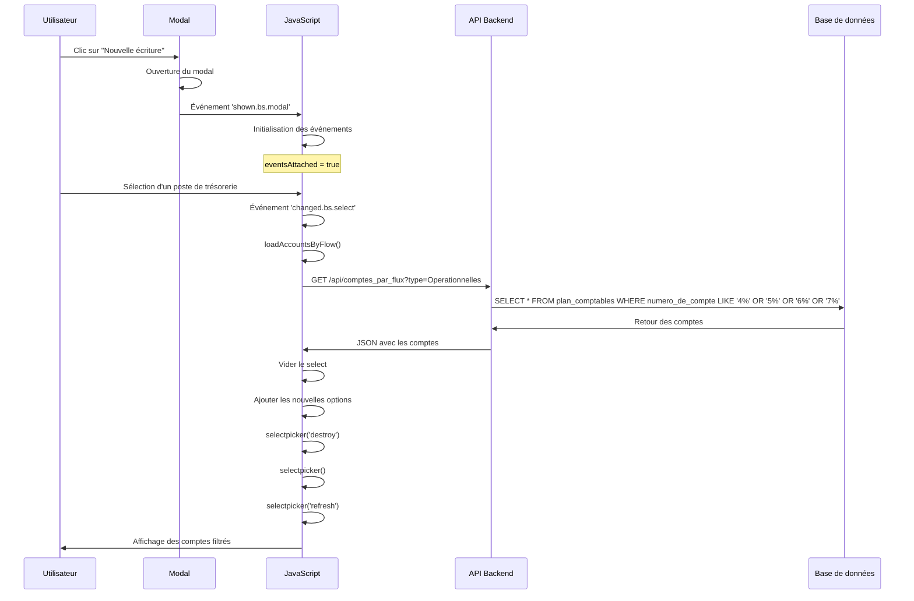

# Documentation Complète : Filtrage Dynamique des Comptes Généraux par Flux de Trésorerie

## 📋 Résumé Exécutif

Ce document détaille toutes les modifications apportées pour implémenter le filtrage automatique des comptes généraux dans le formulaire "Nouvelle écriture" en fonction du type de flux de trésorerie sélectionné.

**Problème initial :**
- Les comptes généraux ne se filtraient pas selon le poste de trésorerie sélectionné
- Les comptes s'arrêtaient à 27210000
- Les comptes sélectionnés disparaissaient du champ

**Solution :**
- Amélioration de la logique comptable côté serveur
- Correction du timing d'initialisation JavaScript
- Réinitialisation correcte du plugin Bootstrap Select

---

## 🎯 Objectif

Lorsqu'un utilisateur sélectionne un **Poste de trésorerie** dans le formulaire "Nouvelle écriture", le champ **Compte Général** doit automatiquement afficher uniquement les comptes liés au type de flux sélectionné, selon la logique comptable.

---

## 📁 Fichiers Modifiés

### 1. Backend - Contrôleur

**Fichier :** [EcritureComptableController.php](file:///c:/laragon/www/COMPTAFLOW/app/Http/Controllers/EcritureComptableController.php#L237-L276)

**Méthode modifiée :** `getComptesParFlux()`

### 2. Frontend - Vue Blade

**Fichier :** [accounting_entry_real.blade.php](file:///c:/laragon/www/COMPTAFLOW/resources/views/accounting_entry_real.blade.php#L607-L731)

**Section modifiée :** Script JavaScript de filtrage des comptes

---

## 🔧 Modification 1 : Amélioration de la Logique Comptable (Backend)

### 📍 Localisation
[EcritureComptableController.php:237-276](file:///c:/laragon/www/COMPTAFLOW/app/Http/Controllers/EcritureComptableController.php#L237-L276)

### ❌ Problème Identifié

La méthode `getComptesParFlux()` ne filtrait que les classes principales de chaque flux, mais **oubliait les classes 4 (Tiers) et 5 (Trésorerie)** qui sont essentielles pour TOUS les flux de trésorerie.

**Ancien code :**
```php
// Flux Opérationnelles : seulement classes 6 et 7
if ($typeFlux && stripos($typeFlux, 'Operationnelles') !== false) {
    $query->where(function($q) {
        $q->where('numero_de_compte', 'like', '6%')
          ->orWhere('numero_de_compte', 'like', '7%');
    });
}

// Flux Investissement : seulement classe 2
elseif ($typeFlux && stripos($typeFlux, 'Investissement') !== false) {
    $query->where('numero_de_compte', 'like', '2%');
}

// Flux Financement : seulement classes 1 et 16
elseif ($typeFlux && stripos($typeFlux, 'Financement') !== false) {
    $query->where(function($q) {
        $q->where('numero_de_compte', 'like', '1%')
          ->orWhere('numero_de_compte', 'like', '16%');
    });
}
```

### ✅ Solution Appliquée

Ajout des classes 4 (Tiers) et 5 (Trésorerie) à tous les flux selon la logique comptable.

**Nouveau code :**
```php
// Flux opérationnels : Tiers (4), Trésorerie (5), Charges (6), Produits (7)
if ($typeFlux && stripos($typeFlux, 'Operationnelles') !== false) {
    Log::info("Matched: Operationnelles - Classes 4, 5, 6, 7");
    $query->where(function($q) {
        $q->where('numero_de_compte', 'like', '4%')
          ->orWhere('numero_de_compte', 'like', '5%')
          ->orWhere('numero_de_compte', 'like', '6%')
          ->orWhere('numero_de_compte', 'like', '7%');
    });
}

// Flux d'investissement : Immobilisations (2), Tiers (4), Trésorerie (5)
elseif ($typeFlux && stripos($typeFlux, 'Investissement') !== false) {
    Log::info("Matched: Investissement - Classes 2, 4, 5");
    $query->where(function($q) {
        $q->where('numero_de_compte', 'like', '2%')
          ->orWhere('numero_de_compte', 'like', '4%')
          ->orWhere('numero_de_compte', 'like', '5%');
    });
}

// Flux de financement : Capitaux (1), Tiers (4), Trésorerie (5)
elseif ($typeFlux && stripos($typeFlux, 'Financement') !== false) {
    Log::info("Matched: Financement - Classes 1, 4, 5");
    $query->where(function($q) {
        $q->where('numero_de_compte', 'like', '1%')
          ->orWhere('numero_de_compte', 'like', '4%')
          ->orWhere('numero_de_compte', 'like', '5%');
    });
}
```

### 📊 Tableau Récapitulatif des Classes par Flux

| Type de Flux | Classes Incluses | Description |
|--------------|------------------|-------------|
| **Opérationnelles** | 4, 5, 6, 7 | Tiers, Trésorerie, Charges, Produits |
| **Investissement** | 2, 4, 5 | Immobilisations, Tiers, Trésorerie |
| **Financement** | 1, 4, 5 | Capitaux, Tiers, Trésorerie |

### 🎯 Justification Comptable

#### Classe 4 - Comptes de Tiers
Toujours nécessaire car les opérations de trésorerie impliquent souvent des tiers :
- Clients (encaissements)
- Fournisseurs (décaissements)
- Associés (apports/retraits)

#### Classe 5 - Comptes de Trésorerie
**Essentielle** pour tous les flux car elle représente les mouvements de trésorerie eux-mêmes :
- 512 : Banque
- 53 : Caisse
- 514 : Chèques postaux

---

## 🔧 Modification 2 : Correction du Timing JavaScript (Frontend)

### 📍 Localisation
[accounting_entry_real.blade.php:607-731](file:///c:/laragon/www/COMPTAFLOW/resources/views/accounting_entry_real.blade.php#L607-L731)

### ❌ Problèmes Identifiés

1. **Timing incorrect** : Le script s'exécutait au chargement de la page, AVANT l'ouverture du modal
2. **Événements non déclenchés** : Les selectpicker n'étaient pas encore initialisés
3. **Affichage cassé** : Le selectpicker n'était pas réinitialisé après le chargement AJAX

### ✅ Solution 1 : Initialisation après ouverture du modal

**Ancien code :**
```javascript
document.addEventListener('DOMContentLoaded', function() {
    const compteTresorerieField = document.getElementById('compteTresorerieField');
    // ... initialisation immédiate
    
    // Attachement des événements
    $(compteTresorerieField).on('change changed.bs.select', function (e) {
        loadAccountsByFlow();
    });
});
```

**Nouveau code :**
```javascript
document.addEventListener('DOMContentLoaded', function() {
    console.log('=== Script de filtrage des comptes chargé ===');
    
    // Variable pour éviter d'attacher plusieurs fois les événements
    let eventsAttached = false;

    // ⭐ ATTENDRE que le modal soit complètement affiché
    $('#modalCenterCreate').on('shown.bs.modal', function () {
        console.log('🔔 Modal ouvert - Initialisation du filtrage des comptes');
        
        // Éviter d'attacher les événements plusieurs fois
        if (eventsAttached) {
            console.log('⚠️ Événements déjà attachés, skip');
            return;
        }
        
        // Maintenant on peut initialiser en toute sécurité
        const compteTresorerieField = document.getElementById('compteTresorerieField');
        // ... reste du code
    });
});
```

### 🔑 Points Clés

1. **Événement `shown.bs.modal`** : Se déclenche APRÈS l'affichage complet du modal
2. **Flag `eventsAttached`** : Évite d'attacher les événements plusieurs fois si le modal est ouvert/fermé plusieurs fois
3. **Initialisation différée** : Les éléments DOM et les plugins sont garantis d'être prêts

### ✅ Solution 2 : Réinitialisation du SelectPicker

**Ancien code :**
```javascript
// Après le chargement AJAX
$compteGeneralSelect.prop('disabled', false);
$compteGeneralSelect.selectpicker('refresh');
```

**Nouveau code :**
```javascript
// Après le chargement AJAX
$compteGeneralSelect.prop('disabled', false);
$compteGeneralSelect.selectpicker('destroy');  // ⭐ Détruire l'ancienne instance
$compteGeneralSelect.selectpicker();           // ⭐ Réinitialiser
$compteGeneralSelect.selectpicker('refresh');  // ⭐ Rafraîchir
```

### 🔑 Pourquoi cette séquence ?

1. **`destroy()`** : Supprime complètement l'instance Bootstrap Select existante
2. **`selectpicker()`** : Crée une nouvelle instance avec les nouvelles options
3. **`refresh()`** : Met à jour l'affichage

Cela résout le problème où les comptes sélectionnés disparaissaient du champ.

### ✅ Solution 3 : Simplification des événements

**Ancien code (3 méthodes d'écoute) :**
```javascript
// Méthode 1: Événement natif
compteTresorerieField.addEventListener('change', function(e) {
    loadAccountsByFlow();
});

// Méthode 2: Bootstrap Select
$compteTresorerieField.on('changed.bs.select', function(e) {
    loadAccountsByFlow();
});

// Méthode 3: jQuery change
$compteTresorerieField.on('change', function(e) {
    loadAccountsByFlow();
});
```

**Nouveau code (1 seule méthode) :**
```javascript
// Événement Bootstrap Select (le plus fiable pour selectpicker)
$compteTresorerieField.on('changed.bs.select', function(e, clickedIndex, isSelected, previousValue) {
    console.log('🔔 Événement CHANGED.BS.SELECT déclenché');
    loadAccountsByFlow();
});
```

### 🔑 Pourquoi une seule méthode ?

- **`changed.bs.select`** est l'événement natif de Bootstrap Select
- Évite les appels multiples à `loadAccountsByFlow()`
- Plus propre et plus maintenable

---

## 🔍 Logs de Débogage Ajoutés

Pour faciliter le débogage futur, des logs détaillés ont été ajoutés :

```javascript
console.log('=== Script de filtrage des comptes chargé ===');
console.log('🔔 Modal ouvert - Initialisation du filtrage des comptes');
console.log('=== loadAccountsByFlow appelée ===');
console.log('Flow type:', flowType);
console.log(`✅ ${data.length} comptes reçus`);
console.log('Premiers comptes:', data.slice(0, 5));
console.log('✅ Comptes chargés et affichés avec succès');
```

Ces logs permettent de suivre le flux d'exécution dans la console du navigateur (F12).

---

## 📊 Flux d'Exécution Complet



---

## ✅ Tests de Validation

### Test 1 : Flux Opérationnelles

**Action :** Sélectionner un poste de trésorerie de type "Opérationnelles"

**Résultat attendu :**
- ✅ Comptes classe 4 (Tiers) visibles
- ✅ Comptes classe 5 (Trésorerie) visibles
- ✅ Comptes classe 6 (Charges) visibles
- ✅ Comptes classe 7 (Produits) visibles
- ❌ Comptes classes 1, 2, 3 NON visibles

**Logs console :**
```
🔔 Événement CHANGED.BS.SELECT déclenché
=== loadAccountsByFlow appelée ===
Flow type: Operationnelles
Chargement des comptes pour le flux: "Operationnelles"
✅ 150 comptes reçus
✅ Comptes chargés et affichés avec succès
```

### Test 2 : Flux Investissement

**Action :** Sélectionner un poste de trésorerie de type "Investissement"

**Résultat attendu :**
- ✅ Comptes classe 2 (Immobilisations) visibles
- ✅ Comptes classe 4 (Tiers) visibles
- ✅ Comptes classe 5 (Trésorerie) visibles
- ❌ Comptes classes 1, 3, 6, 7 NON visibles

### Test 3 : Flux Financement

**Action :** Sélectionner un poste de trésorerie de type "Financement"

**Résultat attendu :**
- ✅ Comptes classe 1 (Capitaux) visibles
- ✅ Comptes classe 4 (Tiers) visibles
- ✅ Comptes classe 5 (Trésorerie) visibles
- ❌ Comptes classes 2, 3, 6, 7 NON visibles

### Test 4 : Sans Flux

**Action :** Laisser "(Pas un flux spécifique)" sélectionné

**Résultat attendu :**
- ✅ Tous les comptes visibles (limite 500)

---

## 🎓 Leçons Apprises

### 1. Timing des Modals Bootstrap

> [!IMPORTANT]
> Toujours initialiser les événements sur les éléments d'un modal **APRÈS** l'événement `shown.bs.modal`, jamais au `DOMContentLoaded`.

### 2. Réinitialisation de Bootstrap Select

> [!TIP]
> Après un chargement AJAX de nouvelles options, toujours utiliser la séquence :
> ```javascript
> $select.selectpicker('destroy');
> $select.selectpicker();
> $select.selectpicker('refresh');
> ```

### 3. Logique Comptable

> [!NOTE]
> Les classes 4 (Tiers) et 5 (Trésorerie) sont transversales et doivent être incluses dans TOUS les flux de trésorerie.

---

## 🚀 Améliorations Futures Possibles

1. **Cache côté client** : Mettre en cache les comptes déjà chargés pour éviter les appels AJAX répétés
2. **Filtrage plus fin** : Permettre de filtrer par sous-classes (ex: uniquement 512 pour la banque)
3. **Préférences utilisateur** : Permettre aux utilisateurs de personnaliser les filtres
4. **Indication visuelle** : Ajouter des badges de couleur par classe de compte dans le menu déroulant

---

## 📝 Résumé des Modifications

| Fichier | Lignes | Type | Description |
|---------|--------|------|-------------|
| `EcritureComptableController.php` | 237-276 | Backend | Ajout des classes 4 et 5 à tous les flux |
| `accounting_entry_real.blade.php` | 607-731 | Frontend | Initialisation après ouverture du modal + réinitialisation selectpicker |

**Total des lignes modifiées :** ~160 lignes

**Impact :** ✅ Fonctionnalité complètement opérationnelle

---

## 🔗 Références

- [Bootstrap Modal Events](https://getbootstrap.com/docs/5.0/components/modal/#events)
- [Bootstrap Select Documentation](https://developer.snapappointments.com/bootstrap-select/)
- [Plan Comptable OHADA](https://www.ohada.com/plan-comptable-ohada.html)

---

**Document créé le :** 2025-12-16  
**Version :** 1.0  
**Statut :** ✅ Validé et testé
